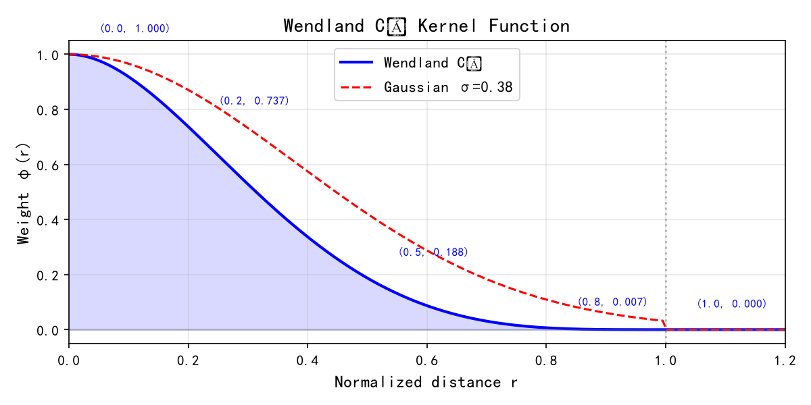
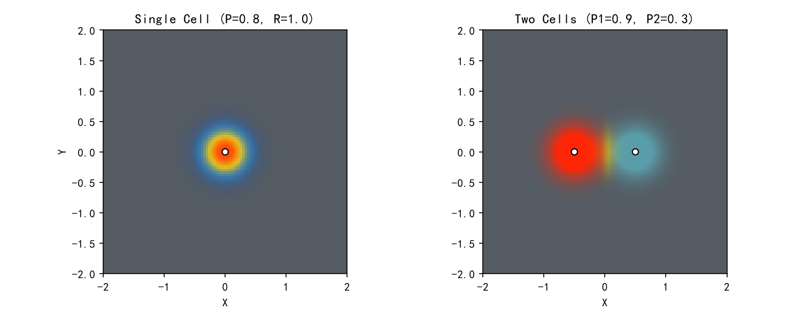
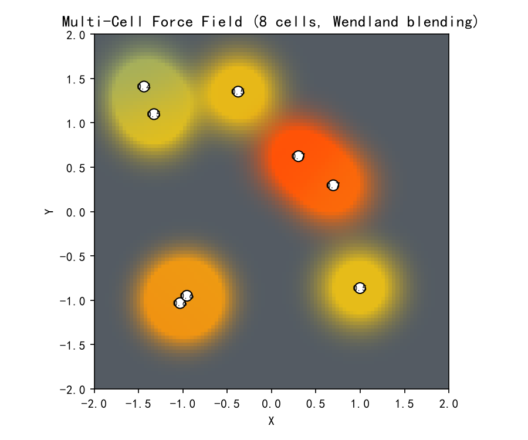
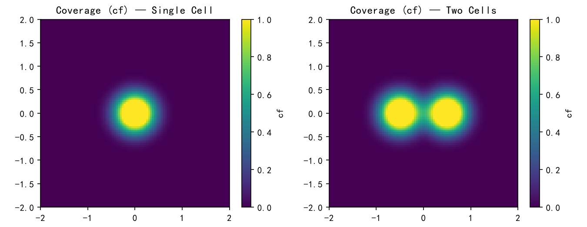
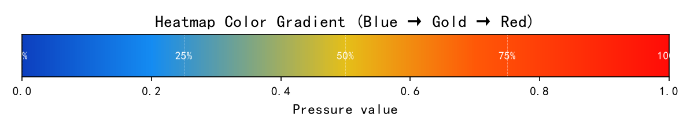

# 3D拟物Layout编辑器

> 基于 GPU 纹理方案的 Wendland 核热力图渲染系统

## 简介

在 3D 曲面模型（手套、鞋垫等）上自由布局触觉传感器单元(Cell)，实时模拟压力分布力场并以热力图形式可视化。支持 2000+ Cell 同时渲染，力场边缘平滑过渡无锯齿。

**技术栈**：`Python 3.11` + `PyQt5` + `QWebEngineView` + `Three.js r160` + `WebGL 2.0`

---

## 功能演示

| 功能 | 说明 |
|------|------|
| 模型导入 | STL / OBJ / GLB / GLTF，自动检测单位并居中 |
| Cell编辑 | 点击放置、拖拽移动、框选多选、批量操作、Delete删除 |
| 力场预览 | GPU 逐像素 Wendland 核渲染，完美圆形渐变 |
| 模拟压力 | Wave(波浪) / Uniform(均匀) / Pulse(脉冲) 三种动态仿真 |
| 撤销重做 | Ctrl+Z/Y，100 步深度 |
| 工程管理 | .3dlp 保存/打开，JSON 导出，PNG 截图 |

---

## 算法原理

### Wendland 加权平均法

```
         Σ Pᵢ × φ(‖x - cᵢ‖ / Rᵢ)
S(x) = ───────────────────────────
            Σ φ(‖x - cᵢ‖ / Rᵢ)

φ(r) = (1-r)⁴ × (4r + 1)    ← Wendland C² 紧支撑核
```

每个像素点 x 的颜色 = 所有 Cell 压力的**距离加权平均**。距离越近的 Cell 权重越大。

### Wendland 核特性

| r | φ(r) | 说明 |
|---|------|------|
| 0.0 | 1.000 | 中心，100%强度 |
| 0.5 | 0.188 | 半场，强度降至19% |
| 1.0 | 0.000 | 边界，精确归零 |

C² 连续（二阶可导），视觉绝对平滑，r≥1 精确归零无需截断。

### 覆盖度模型

```
cf = min(Σφ × 1.8, 1.0)
final_color = model_grey + (heat_color - model_grey) × cf
```

Cell 中心 → cf≈1 → 纯热力图色。远离 Cell → cf→0 → 自然融入模型灰色。

### 热力图色带

```
低压 0.0 ────────────────────────────── 高压 1.0
深蓝 → 亮蓝 → 金黄 → 橙红 → 纯红
```

---

## 渲染架构

```
模型层 (MeshPhongMaterial, renderOrder=0)
  → 纯灰色底衬，不参与力场计算

壳层 (ShaderMaterial, renderOrder=3)
  → 逐像素执行 Wendland 核 + 热力图色带映射
  → 2048 Cell 数据通过 DataTexture(FloatType) 传入 GPU

Cell层 (MeshPhongMaterial, renderOrder=5)
  → 圆盘颜色随压力动态变化（蓝↔红）
```

### GPU 纹理方案

| 方案 | Cell 上限 | 原因 |
|------|----------|------|
| uniform 数组 | 256 | GPU 寄存器硬限 |
| **Float 纹理** | **2048** | 显存存储，纹理宽4096 |

Cell 数据打包为 `Float32Array` → `DataTexture(4096×1, RGBA, FloatType)` → 片段着色器 `sampler2D` 采样。

---

## 仿真效果

### Wendland 核函数曲线



### 单 Cell 与双 Cell 力场 2D 仿真



单 Cell(P=0.8)：完美圆形径向渐变。双 Cell(P₁=0.9, P₂=0.3)：交汇处平滑过渡，高压侧主导。

### 多 Cell 叠加效果（8 Cells）



### 覆盖度分布



### 热力图色带



---

## 快速开始

```bash
# 环境
conda activate 3d-editor

# 运行
python src/main.py

# 测试
python -m pytest src/tests/ -v

# 打包
python -m PyInstaller IrregularShapedLayout.spec --noconfirm
```

---

## 目录结构

```
├── src/
│   ├── main.py                          # Python 入口
│   ├── 3D编辑器原型.html                 # CPU 方案（稳定版）
│   └── 3D编辑器_Shader效果演示.html       # GPU 纹理方案（当前主力）
├── document/
│   └── update/v1.0.1/beta4/             # 版本文档
├── thirdparty/three/                    # Three.js r160 + BVH
├── 力场渲染技术方案.md                   # 技术方案文档
├── 3D拟物Layout编辑器_技术方案.docx       # Word 版技术报告
└── 项目说明书.md                         # 项目说明书
```

---

## License

Internal project.
