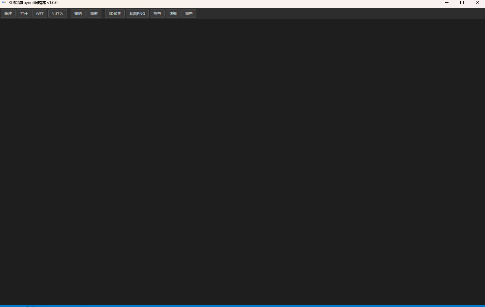

# 问题清单 - v1.0.0 / beta2

> **创建日期**: 2026-07
> **最后更新**: 2026-07-08 — 第三轮需求更新

---

## 置顶区（待用户确认，阻塞开发）

> 本区问题必须由用户明确答复后才能进入开发或下一 Stage。

---

### QN1. 需求 #0 — 添加模型后闪退

- **问题描述**：用户反馈界面已可正常显示（PyQt5迁移+import修复生效），但导入模型后点击/添加模型时应用闪退。未说明是否所有操作都闪退、是否仅特定步骤触发。

- **建议方案**：先检查终端日志中的 `[JS Error]` / Python traceback，定位崩溃点。高概率是 WebGL 不可用时 THREE.js 创建 WebGLRenderer 失败导致的未捕获异常。

- **风险预警**：如果根因是 QtWebEngineProcess 崩溃，需要在 Chromium 日志中定位（`--enable-logging --v=1`）。如果是 JS 端 NPE，修复较简单。

- **置信度**：60% — 缺少崩溃日志。

- **归入置顶原因**：需要用户提供操作步骤和终端输出以定位。

**回复：**（待用户填写）

---

### QN2. 需求 #3 — 菜单栏点不开

- **问题描述**：HTML 顶部菜单栏"文件、编辑、视图、工具"点击无反应，下拉菜单不展开。

- **建议方案**：检查 JS 事件绑定。菜单栏点击绑在 `document.querySelectorAll('.menubar .menu-item')` 上，可能因为 HTML 加载时序问题导致事件未绑定，或被 Python Bridge 端注入的 JS 意外拦截。

- **风险预警**：如果根因是 CSS z-index 被 Python toolbar 覆盖，则非 JS 问题。

- **置信度**：70% — 需要实际查看 HTML/JS 代码确认。

- **归入置顶原因**：可能涉及 CSS/JS 交互，需要实际验证。

**回复：**（待用户填写）

---

## 自决区（≥ 90% 置信，已自决，不阻塞开发）

> 本区问题由 MainAgent 自主决策，用户可随时否决或提出异议，但不阻塞当前开发流程。

---

### QN3. 需求 #1 — 移除工具栏按钮

- **问题描述**：需移除 HTML 工具栏中的"加载STL""保存JSON""打开JSON"按钮，这些操作已移至 Python 工具栏。

- **自决方案**：直接删除 HTML `<div class="toolbar">` 中对应的三行 `<button>` 元素，同时在 `_init_webview` 的 ready 回调中移除对应的隐藏逻辑。

- **自决理由**：按钮功能已由 Python 端接管，HTML 端保留会造成用户混淆。纯 DOM 修改，无风险。

- **置信度**：98%

---

### QN4. 需求 #2 — 模型渲染不正确

- **问题描述**：与旧 #2 同。已修复 bbox 顺序和位置累积问题，但当前环境 WebGL 不可用（远程 GPU 限制），在有 GPU 的机器上需验证。

- **自决方案**：当前代码修复已完成。在有 GPU 机器上运行即可验证。

- **自决理由**：代码逻辑修复已通过单元测试。渲染问题需实际 GPU 环境验证。

- **置信度**：90%

- **问题描述**：需求第 0 条仅描述"界面基础现在显示已经完全不正确了，怎么原有的内容都空了？"，未给出可复现的操作步骤或具体异常现象（白屏？部分控件缺失？3D 画布空白？HTML 报错？）。
  已初步排查：根级 `main.py` 和根级 `3D编辑器原型.html` 在上一次提交中被删除，现在入口变为 `src/main.py`。`src/main.py` 中的 `html_path` 指向 `src/3D编辑器原型.html`，通过本地 HTTP 服务加载。三条关键 HTTP 路径（HTML、three.module.js、bvh/index.module.js）经测试均能正常返回 200，文件与路径完整。

- **建议方案**：
  - 如果你之前用 `python main.py`（根目录入口）启动 → 现在会失败，因为根级 main.py 已不存在。正确命令是 `python src/main.py`。
  - 如果你用 `python src/main.py` 启动但界面不对 → 请描述你看到的是什么（例如：窗口空白/只有 toolbar/3D 黑色但 HTML 控件可见/菜单栏不显示/报错弹窗等）。

- **备选方案**：
  - 方案 A：保持当前 `python src/main.py` 入口，在根目录放一个引导 `main.py`（已实现但不阻塞规划）。
  - 方案 B：回退到旧结构（根目录放 HTML + lib），但这与当前仓库布局冲突。

- **风险预警**：如果根因是 QWebEngineView 的 WebGL 渲染问题或 Three.js importmap 在 Qt WebEngine 中的兼容性问题，仅靠路径检查无法发现，需要实际启动验证。

- **置信度**：40% — 对用户实际看到的异常现象完全不清楚，无法判断根因。

- **归入置顶原因**：无法在没有用户报告的具体症状下做出针对性修复。

回复: `python src/main.py` 启动但界面不对,启动界面只显示最上端的工具栏，左侧的cell栏右侧下侧都没有， `python main.py`（根目录入口）启动的结果也是，
回复追加：启动界面只显示最上端的工具栏，左侧的cell栏右侧和下侧什么都不显示，新建的时候导入正确的3D文件软件不显示，无反应

**诊断结论（2026-07-07）**：
根因确定为 **QtWebEngineProcess.exe 缺失**。当前 conda 环境中的 PySide6 6.9.2 未携带该二进制文件，导致 `QWebEngineView` 无法渲染任何网页（包括最简单的 `<h1>Hello</h1>`）。
- 已验证：HTTP 服务器正常，URL 解析正常，路径正确
- 已验证：`setHtml()` 加载纯 HTML 同样返回 `loadFinished=false`
- 已验证：`simple HTTP server` 能正常 200 返回 HTML 和三件 JS 模块
- 缺少包：`qt6-webengine`（conda-forge）
- 修复命令：`conda install qt6-webengine -c conda-forge`
- 状态：**阻塞** — 当前网络环境无法安装 conda 包，需用户手动执行安装

---

### Q2. 需求 #1 —「模型大小」字段的语义

- **问题描述**：需求第 1 条要求新建项目 Dialog 包含"模型地址、模型大小"两个字段。"模型地址"含义明确（文件路径）。"模型大小"有三种可能解释：
  - **A. 单位比例 (mm/模型单位)**：1 个 3D 模型单位对应多少真实 mm。当前 Three.js 代码已有 `unitMM` 变量和自动检测逻辑。
  - **B. 模型物理尺寸**：模型在真实世界中的长 × 宽 × 高（mm），通常导入后可自动计算。
  - **C. 模型文件大小**：STL 文件在磁盘上的字节数，一般只读显示。

- **建议方案**：采用 **A（单位比例 mm/模型单位）**。理由是：已有代码支持此参数（`unitMM` + `autoDetectUnit()`），这是控制 Cell 贴合精度的关键参数，且无法从模型文件中自动获取（STL 不含单位信息）。同时可以在 Dialog 中补充"实际尺寸"作为只读信息（导入后自动计算显示），以及文件大小展示。

- **备选方案**：
  - 方案 A：单位比例（mm/单位）— **推荐**，鲁棒性高，可测试。
  - 方案 B：物理尺寸 — 可自动计算，用作编辑输入容易出错。
  - 方案 C：文件大小 — 仅展示用，不参与业务逻辑。

- **风险预警**：如果用户实际想要的是物理尺寸（例如手动输入预期尺寸来过载自动检测结果），而 Dialog 只提供单位比例，则需要二次修改。

- **置信度**：60% — "模型大小"的措辞更像指物理尺寸，但从工程意义和历史代码习惯看，单位比例才是关键参数。

- **归入置顶原因**：三种解释的交互设计完全不同，选错需要重构 Dialog。


回复：方案A
---

### Q3. 需求 #2 — 模型渲染"没有正确在显示3D模型的位置渲染"的具体表现

- **问题描述**：需求第 2 条只描述"没有正确在该显示3D模型的位置渲染"，同样缺少具体异常描述：
  - 模型完全不可见（3D 画布全黑）？
  - 模型可见但位置不对（偏离中心、缩小到看不见）？
  - 模型可见但颜色/材质异常？
  - 特定操作（放大、旋转、放置 Cell）后才出现异常？
  - 特定模型（手套 STL）有问题，还是所有 STL 都有问题？

  已初步检查 `loadStl` 的 JS 实现，发现两处潜在问题：
  1. `src/3D编辑器原型.html:618-621`（以及独立模式对应位置）：旧代码在加载新模型时，**先根据包含旧 Cell 的 `RT` 计算包围盒再清理 Cell**，可能导致模型居中偏移；且使用 `RT.position.sub(ctr)` 会累积偏移。
  2. 已修改为：先清理旧 Cell → 仅用 `M`（不含 Cell）计算包围盒 → 用 `RT.position.set()` 重置而非累积。

- **建议方案**：提供以下任一信息以缩小排查范围：
  - 当前操作步骤（例如：启动应用 → 点击"新建" → 选择某某 STL → 看到什么）
  - 如果方便，提供一张截图描述或说明看到的现象
  - 是否有控制台报错（`[JS Console]` 或 `[JS Error]` 输出）

- **备选方案**：暂无，必须先确认症状。

- **风险预警**：如果根因是特定模型的格式问题（非标准 STL、大文件性能问题、BVH 构建超时），简单修代码可能无效。

- **置信度**：35% — 缺少可复现的症状描述。

- **归入置顶原因**：不知道现象就无法判断哪段代码有问题。

回复：启动界面只显示最上端的工具栏，左侧的cell栏右侧和下侧什么都不显示，新建的时候导入正确的3D文件软件不显示，无反应

---

## 自决区（≥ 90% 置信，已自决，不阻塞开发）

> 本区问题由 MainAgent 自主决策，用户可随时否决或提出异议，但不阻塞当前开发流程。

---

### Q4. 需求 #1 — NewProjectDialog 应增加哪些额外字段

- **问题描述**：需求要求至少包含"项目名称、传感器通道数、模型地址、模型大小"4 个字段。从项目完整性和后续使用便利性考虑，建议增加以下字段。

- **自决方案**：在 Dialog 中增加以下字段：
  1. **设备类型**（下拉框：手套 / 鞋垫 / 自定义）— 与 project.json 的 `device_model` 字段对齐，后续可用于不同设备的默认参数。
  2. **描述**（多行文本框，可选）— 用户备注项目用途、变更记录等。
  3. **创建时间** — 自动生成，不展示在 Dialog 中。

- **自决理由**：现有 `src/main.py` 中的 `_on_export()` 已输出 `device_model` 和 `display_name` 字段。增加设备类型和描述可让保存的 project.json 更完整且可追溯。无额外代码依赖，纯表单扩展。

- **风险预警**：如果用户不需要这些额外字段，Dialog 显得臃肿。但填"可选"的字段不影响工作流。

- **置信度**：95%

回复：不需要额外的功能，当前的功能足够
---

### Q5. 需求 #1 — 传感器通道数的默认值与范围

- **问题描述**：需求未指定默认通道数。当前 HTML 代码中 `MAX` 初始值为 0，模型加载后由 `recommendedChannels` 自动推导（公式 `Math.round(surfaceAreaMM2/400)`）。

- **自决方案**：NewProjectDialog 的通道数输入框：
  - **默认值**：200（项目规格中最大通道数）
  - **范围**：1 ~ 200
  - **可选选中"自动"**：导入模型后由 JS 端 `recommendedChannels` 覆盖
  - **优先级**：用户手动输入 > 自动推导

- **自决理由**：200 是 AGENTS.md 中声明的 Max cells 上限，与 `MAX_RECENT` 等常量对齐。自动推导逻辑已存在于 HTML 中（`surfaceAreaMM2/400`），只需在 Dialog 中提供手动覆盖入口。

- **风险预警**：如果用户在 Dialog 中设了 200，导入后的自动推导会把 200 覆盖掉（如果 `total_points` 优先）。已通过"用户手动输入优先"策略规避。

- **置信度**：95%
回复：用户指定通道数，通道数不设置上限
---

### Q6. 需求 #1 / #3 — STEP/STP 文件转换策略

- **问题描述**：旧版 `src/main.py` 中有 `stp_convert.py` + `conda run -n occ` 的 STEP→STL 转换逻辑，但当前仓库中 `stp_convert.py` 不存在，conda 环境 `occ` 也未必安装。新版本是否还需要支持 STEP 格式？

- **自决方案**：当前版本**仅支持 STL 格式**。不支持 STP/STEP/OBJ/GLB 等其他格式。理由：
  1. `stp_convert.py` 不存在，无法测试。
  2. 依赖 conda 环境 `occ` 会增加部署复杂度。
  3. 需求中没有明确要求 STEP 支持。
  以后可通过插件/子进程方式扩展，不影响当前架构。

- **自决理由**：STEP 转换是独立功能点，需求中未提及。现有 STLLoader 只支持 STL。保留格式检查 + 拒绝非 STL 文件 + 清晰报错即可。

- **风险预警**：如果用户的模型全是 STEP 格式，需要后续版本补充。当前版本只能回退到 STL。

- **置信度**：90%
回复：支持 STP/STEP/OBJ/GLB 等其他格式，修改相关代码逻辑，在3d-editor环境中配置需要的依赖项
---

### Q7. 需求 #3 — 保存/导出 Package 的设计方案

- **问题描述**：需求第 3 条要求设计导出模式。当前行为：保存为单个 JSON 文件，内嵌 base64 编码的 STL 数据。这对大模型（如 75MB 手套 STL）会导致 JSON 文件约 100MB，不便于版本管理和传输。

- **自决方案**：采用 ZIP 压缩包格式（后缀名 `.3dlp` = 3D Layout Package），内部结构：
  ```
  project.3dlp (ZIP)
  ├── project.json     # 项目元数据 + Cell 数据（不含 base64 模型）
  └── {model_name}.stl # 原始 STL 模型文件
  ```
  
  `project.json` 内容结构：
  ```json
  {
    "version": "2.0",
    "project_name": "...",
    "device_type": "...",
    "description": "...",
    "created_at": "2026-...",
    "total_points": 200,
    "unit_mm": 1.0,
    "model_file": "model.stl",
    "cells": [
      {
        "id": 0,
        "center_3d": {"x": ..., "y": ..., "z": ...},
        "normal": {"x": ..., "y": ..., "z": ...},
        "radius_mm": ..., "rotation_deg": ..., "label": "..."
      }
    ]
  }
  ```
  
  同时**保留对旧版 `.json`（内嵌 base64 模型）的打开兼容**。

- **自决理由**：ZIP 是标准格式，Python 标准库 `zipfile` 即可处理，无需外部依赖。将模型和数据分离使 ZIP 体积与 STL 原文件相当（JSON 部分可忽略不计），便于版本管理和传输。`.3dlp` 后缀可关联应用。

- **风险预警**：如果用户需要跨平台（如 Web 端）直接打开包而不安装应用，ZIP 格式可以手动解压。但 3dlp 后缀不是业界标准，需要在文档中说明。

- **置信度**：95%
回复：  project.3dlp (ZIP)
  ├── project.json     # 项目元数据 + Cell 数据（不含 base64 模型）
  └── {model_name}.stl # 原始 STL 模型文件   这种结构可以，需要你保存的数据在这个软件再次打开的时候，能够保证cell位置正确大小正确，保存的数据都可以正常加载
---

### Q8. Version 规模判定与 Stage 拆分

- **问题描述**：beta2 共有 4 个需求点，是否按规范拆分为多个 Stage/SubStage？

- **自决方案**：按规范 §7，beta2 属于**小规模 Version**（4 个需求点，代码依赖集中在 `src/main.py` + `src/3D编辑器原型.html` 两个文件），不拆分 Stage/SubStage。由 MainAgent 独立完成开发与测试。但必须遵守：问题清单 → 设计文档 → 验收文档 → 开发 → 单元测试 → 启动测试 → 验收 → 完成报告。

- **自决理由**：4 个需求之间接口耦合高（共用同一对 Python↔JS Bridge、同一份 project.json schema、同一 Dialog），拆分 SubStage 反而增加 SubAgent 协调成本。

- **风险预警**：如果后续评审发现某项需求实际工作量远超预期，可在开发中动态追加 Stage。

- **置信度**：95%

回复：可以，按照你的建议 按规范拆分

---

## 第三轮需求更新 (2026-07-08)

---

## 置顶区（第三轮）

### QN5. 需求 #0 — WebGL 在无 GPU 环境的 CPU 替代方案

- **问题描述**：当前机器没有物理 GPU，Qt5 WebEngine (Chromium 83) 的 ANGLE 后端依赖 D3D11，无法创建 WebGL 上下文。需寻找纯 CPU 方案。

- **建议方案**：尝试三种路径，按优先级：
  1. **Qt6 WebEngine** (PySide6) — Chromium 110+ 内建 SwiftShader 软件渲染器，可以在 CPU 上模拟 WebGL。需安装 `pyside6` + `qt6-webengine` 并验证。
  2. **Mesa opengl32sw.dll** — 将 `QT_OPENGL=software` 与 ANGLE 配合。但 Qt5 Chromium 的 ANGLE 可能不走 Mesa 路径，成功率低。
  3. **Canvas2D 降级渲染** — 如都不可行，用 Three.js 的 `CSS2DRenderer` 或纯 Canvas API 做 2D 替代（功能损失大）。

- **备选方案**：暂无。

- **风险预警**：方案1 需重新安装 PySide6 且之前测试过 PySide6 连页面都加载不了。方案3 损失 3D 旋转/缩放等核心交互。

- **置信度**：50% — Qt6 方案不确定能否在本机工作。

- **归入置顶原因**：涉及切换 UI 框架（PyQt5→PySide6），影响面大。

**回复：**（待用户填写）

---

## 自决区（第三轮）

### QN6. 需求 #1 — .exe 输出路径调整

- **问题描述**：当前 PyInstaller 构建输出到 `release/IrregularShapedLayout/`，需改为 `document/update/v1.0.0/beta2/` 方便版本归档。

- **自决方案**：修改 spec 文件 `--distpath` 指向 `document/update/v1.0.0/beta2`。更新 `build.ps1` 脚本中的路径引用保持一致。

- **自决理由**：纯路径配置改动，无代码逻辑影响。

- **置信度**：99%

### QN7. 需求 #3 — 菜单功能键重命名

- **问题描述**：当前顶部菜单"文件"→"加载STL""打开JSON""保存JSON"，命名绑定特定格式。需改为通用命名以支持后续多格式导入。

- **自决方案**：
  - "📂 加载STL" → "📂 导入模型"
  - "📁 打开JSON" → "📁 打开项目"  
  - "💾 保存JSON" → "💾 保存项目"
  - 对应 `pyCommand`/JS 消息提示同步更新

- **自决理由**：纯 UI 文本替换，不影响功能逻辑。

- **置信度**：99%