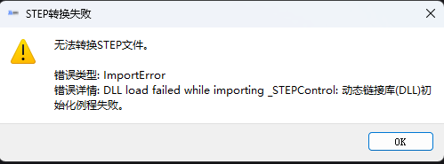

# 需求

## 需求说明

这是一个较大改动的版本，可能需要你自己对这个python版本的代码进行分析和调试

开始工作之前，请你阅读document\Agent开发规范.md
我遇到的问题是：

0. .stp文件导入的时候，提示无法转换step文件，STEP转换失败

⚠️ 无法转换STEP文件。

错误类型: ImportError
错误详情: DLL load failed while importing _STEPControl: 动态链接库(DLL)初始化例程失败。  

但是我D:\workshop\3D-\src\main.py运行后的软件能够正常打开.stp文件

 阅读完该文档，D:\workshop\3D-\document\update\v1.0.0\beta3\问题清单.md   里面的问题是我解答的 如果有新问题请继续补充  对我进行提问确认问题