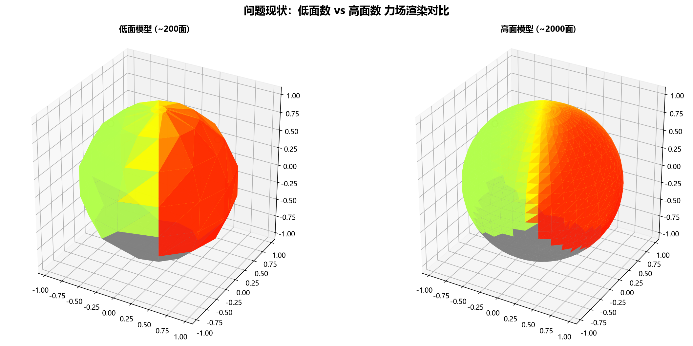
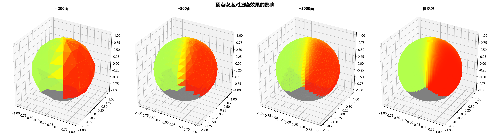
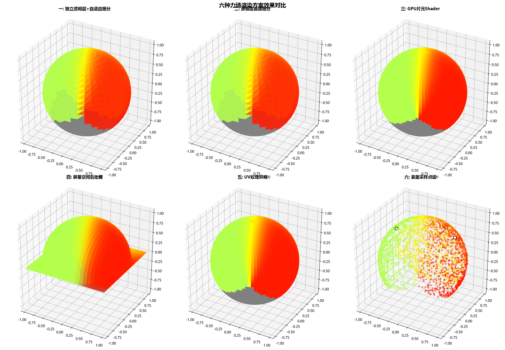
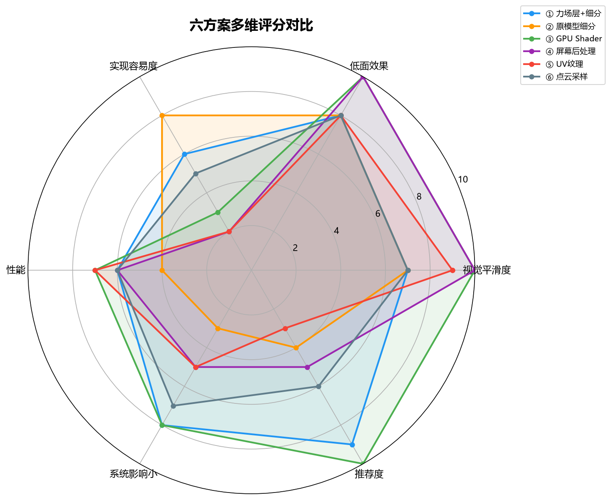
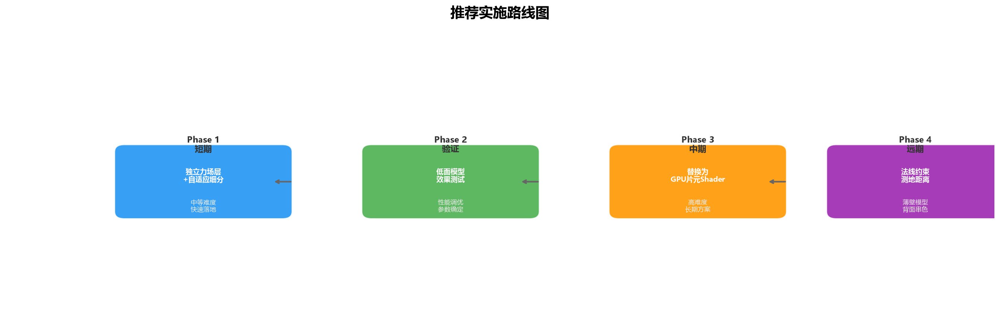

# 低面数模型力场渲染优化 — 方案设计报告

> **版本**: v1.0.1 / 预研阶段
> **日期**: 2026-07-10

---

## 一、问题说明

当前力场颜色计算在模型顶点上，由三角形内部插值。高面数模型顶点密集，颜色过渡自然；低面数模型三角面较大，容易出现热区边界块状、颜色梯度不连续、动态变化不自然等问题。

> 左：~200面低面模型，热区边界呈锯齿状；右：~2000面高面模型，过渡平滑自然

---

## 二、顶点密度与渲染质量

> 从 ~200面 → ~800面 → ~3000面 → 像素级采样，过渡质量逐步提升。临界点在 1000-3000 面之间

---

## 三、六方案可视化对比

---

## 四、方案详解

### 方案一：独立透明力场层 + 自适应细分

**实现思路**：复制原模型几何 → 单独细分 → 沿法线外偏 → 只负责热力图显示

| 维度 | 评分 |
|------|------|
| 视觉平滑度 | ★★★★ |
| 实现难度 | ★★★ |
| 性能 | ★★★ |
| 系统影响 | 极小 |

**优势**：不改原模型，不影响 Cell/BVH/保存，现有 CSR 缓存直接复用，可独立开关

**风险**：细分只增加采样点不改变几何轮廓，透明层可能闪烁

### 方案二：原模型直接细分

**实现思路**：导入后直接细分原模型几何

| 维度 | 评分 |
|------|------|
| 视觉平滑度 | ★★★★ |
| 实现难度 | ★★★★（简单） |
| 性能 | ★★ |
| 系统影响 | 极大 |

**风险**：面数增加影响 BVH、Cell 放置、碰撞检测、面积计算、保存文件大小、打开速度

### 方案三：独立力场层 + GPU 片元 Shader

**实现思路**：透明力场层 + 自定义 ShaderMaterial，GPU 逐像素实时计算 Wendland

| 维度 | 评分 |
|------|------|
| 视觉平滑度 | ★★★★★ |
| 实现难度 | ★★ |
| 性能 | ★★★★ |
| 系统影响 | 极小 |

**风险**：Shader 调试复杂，WebGL 兼容性，不同显卡/QWebEngine 版本需验证

### 方案四：屏幕空间后处理

**实现思路**：渲染模型 → 后处理 Pass 叠加高斯模糊热力图

| 维度 | 评分 |
|------|------|
| 视觉平滑度 | ★★★★★ |
| 实现难度 | ★（极高） |
| 性能 | ★★★ |
| 系统影响 | 中等 |

**风险**：热区可能"浮在屏幕上"，凹面遮挡难处理，三维真实性弱

### 方案五：UV 纹理烘焙

**实现思路**：自动展开 UV → 2D 纹理生成力场 → 贴回模型

| 维度 | 评分 |
|------|------|
| 视觉平滑度 | ★★★★ |
| 实现难度 | ★ |
| 性能 | ★★★★ |
| 系统影响 | 中等 |

**风险**：STL 无 UV，OBJ 的 UV 不可靠，接缝畸变

### 方案六：表面采样点云

**实现思路**：表面均匀采样 → 每点计算力场 → 点精灵/Gaussian 渲染

| 维度 | 评分 |
|------|------|
| 视觉平滑度 | ★★★ |
| 实现难度 | ★★★ |
| 性能 | ★★★ |
| 系统影响 | 极小 |

**风险**：近距离可能看出点状结构，不如曲面着色自然

---

## 五、多维评分对比

---

## 六、推荐结论

### 短期推荐

> **方案一：独立透明力场层 + 自适应细分 + 现有 Wendland 顶点色**

- 最容易接入当前代码
- 不修改原模型，不影响 Cell/BVH/保存/恢复
- 面数阈值：<2000面细分到~8000面；2000-5000面细分到~15000面
- 力场层最大 30 万面，硬上限 50 万面

### 中长期推荐

> **方案三：独立力场层 + GPU 片元 Shader**

- 真正摆脱模型面数限制
- 架构保留独立力场层，升级成本可控
- Phase 1 验证后平滑过渡

### 不建议

强制细分原模型、UV 自动展开、屏幕空间后处理 — 要么影响编辑功能，要么实现复杂度与收益不匹配

---

## 七、实施路线图

| Phase | 内容 | 目标 |
|-------|------|------|
| **Phase 1** | 独立力场层 + 自适应细分 | 解决低面模型过渡问题 |
| **Phase 2** | 低面模型效果测试 | 验证 ~10 个典型产品模型 |
| **Phase 3** | 顶点色 → GPU Shader | 像素级精度，长期方案 |
| **Phase 4** | 法线约束 + 测地距离 | 薄壁模型背面串色 |

---

## 八、决策矩阵

| 方案 | 短期可行性 | 长期价值 | 推荐 |
|------|:--------:|:------:|:----:|
| ① 力场层+细分 | ✅ | ✅ | **主推** |
| ② 原模型细分 | ✅ | ❌ | 验证用 |
| ③ GPU Shader | ❌ | ✅✅ | **长期** |
| ④ 屏幕后处理 | ❌ | ❌ | 搁置 |
| ⑤ UV 纹理 | ❌ | ❌ | 搁置 |
| ⑥ 点云采样 | ✅ | ❌ | 备用 |
